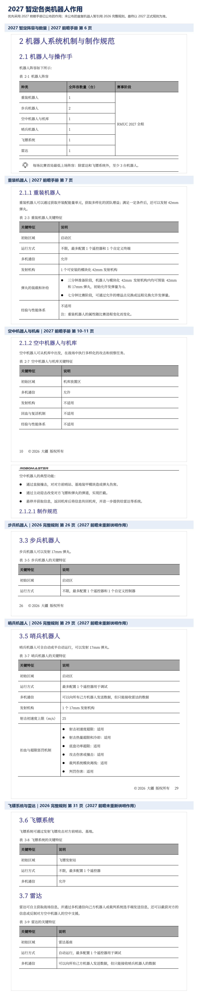
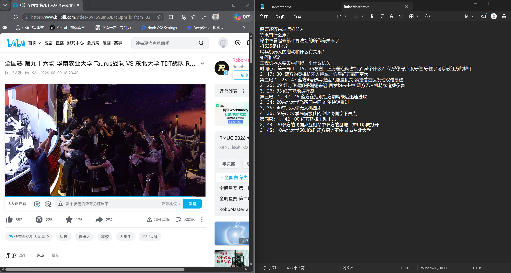
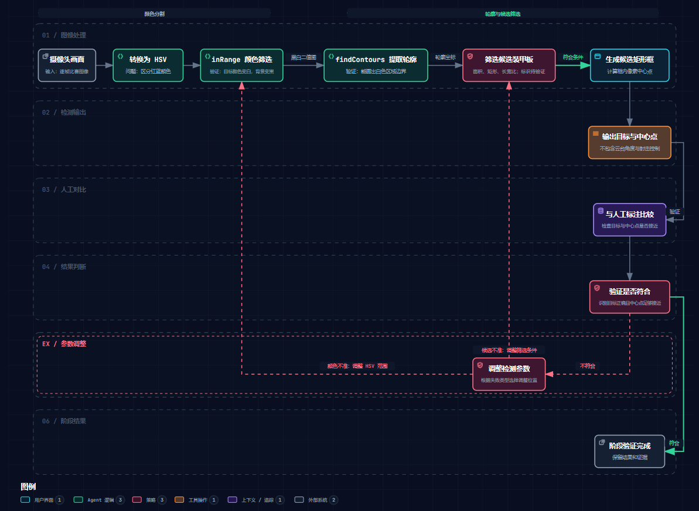

# 北极熊算法组第三部分题目考核报告

- 年级：大一
- 专业：电子信息与计算机工程
- 姓名：廖咏骏

# 1.1 比赛与机器人

## 目标

1. 确认当前可用的最新规则，整理机器人阵容、编号、数量、任务和来源。
2. 观看一场比赛回放，用自己的话说明各类机器人的主要任务。
3. 说明算法组参与哪些机器人和比赛环节。
4. 记录实际阅读的章节、回放链接和仍未理解的内容。

## 资料与用途

- 《RoboMaster 2027 高校系列赛规则变更前瞻手册（20260909）》：确认 2027 暂定阵容、数量，以及重装机器人和空中机器人与机库的新作用。
- 《RoboMaster 2026 机甲大师超级对抗赛比赛规则手册 V2.2.0（20260807）》：补充 2027 前瞻未重新说明的步兵、哨兵、飞镖系统和雷达作用，并保留 2026 编号作为上一赛季参考。

我实际阅读的是第一天保存为截图的页面：2027 前瞻的主要变更概述、机器人阵容第 6 页、重装机器人第 7 页、空中机器人与机库第 10 至 11 页；2026 完整规则的封面、修改日志第 2 至 4 页、机器人阵容第 22 页、步兵机器人第 26 页、哨兵机器人第 29 页，以及飞镖系统和雷达第 31 页。其他机制章节由 AI 根据我的录像疑问进行检索，我只审核了 AI 整理出的解释，没有亲自逐章阅读。

## 学习与实施过程

我没有找到完整的 2027 比赛规则手册，目前只有规则变更前瞻。因此，我优先采用 2027 前瞻已经公布的阵容和作用；前瞻没有重新说明的机器人，暂时引用 2026 完整规则。2026 编号不作为 2027 正式编号，最终内容仍需以之后发布的 2027 正式规则为准。

2026 年 9 月 16 日，我观看了 RoboMaster 官方发布的 [2026 超级对抗赛全国总决赛冠军争夺战：华南农业大学 Taurus 战队对东北大学 TDT 战队](https://www.bilibili.com/video/BV1SVum63E7c)。观看时，我记录了不理解的解说词和关键时间点。随后，AI 根据这些疑问检索 2026 规则手册中的经济、复活、等级、科技核心、堡垒增益点和飞镖伤害等机制，我审核并确认了整理后的解释，但没有亲自逐章阅读这些机制章节。

我最初不理解“打 625”“推钱”和工程机器人在场地中央操作的目标。根据 AI 检索并整理的规则解释：“打 625”通常指飞镖命中基地随机移动目标造成 625 点原始伤害；“推钱”是提高队伍经济的解说用语；工程机器人是在科技核心处装配能量单元，以换取金币和团队增益。第一局约 15:35 的守点场面，结合规则判断，很可能与占领对方堡垒增益点并打开基地护甲有关。由于录像记录不足以确定解说所说的“哨兵启动”具体指哪项机制，我没有把这一点写成确定结论。

## 结果

截至 2026 年 9 月 15 日，2027 前瞻公布的暂定阵容如下。前瞻没有公布机器人编号。

| 机器人 | 编号 | 数量 | 主要作用 | 作用来源 |
| --- | --- | ---: | --- | --- |
| 重装机器人 | 暂未公布 | 1 | 获取并装配能量单元，为团队取得增益；满足条件后可安装模块化发射机构并发射 42mm 弹丸。 | 2027 前瞻第 7 至 8 页 |
| 步兵机器人 | 暂未公布 | 2 | 使用 17mm 发射机构进行常规战斗。 | 2026 完整规则第 26 至 28 页 |
| 空中机器人与机库 | 暂未公布 | 1 | 从机库出发执行攻击和侦察任务，可撞击目标、拦截飞镖和弹丸，并把收集的信息带回机库。 | 2027 前瞻第 10 至 12 页 |
| 哨兵机器人 | 暂未公布 | 1 | 全自动或半自动运行，发射 17mm 弹丸，并与己方机器人和雷达交换数据。 | 2026 完整规则第 29 至 31 页 |
| 飞镖系统 | 暂未公布 | 1 | 发射飞镖攻击对方前哨站或基地。 | 2026 完整规则第 31 页 |
| 雷达 | 暂未公布 | 1 | 获取并发送战场信息，也可截获对方信息或反制对方空中支援。 | 2026 完整规则第 31 页 |

### 比赛回放观察

- 第一局约 15:35，蓝方接近完成一次关键区域占领，但未能守住；约 17:30，蓝方英雄机器人翻车，战局明显向红方倾斜。
- 第二局约 25:47，蓝方 4 号步兵机器人激活大能量机关，随后雷达发动双倍易伤；约 26:09，红方四发飞镖均未命中，蓝方空中机器人持续造成伤害；约 26:35，红方基地被摧毁。
- 第三局约 32:45，蓝方摧毁红方前哨站后迅速进攻；约 34:20，东北大学飞镖四发全中；约 35:40，东北大学空中机器人连续击毁四台机器人；约 36:50，东北大学通过空地协同取得赛点。
- 第四局约 42:00，红方主动出击；约 43:20，双方飞镖均命中对方基地并打开基地护甲；约 45:10，东北大学形成多条枪线并赢得比赛。

### 算法组可能参与的环节

- 目标识别、自动瞄准和弹道预测会影响机器人的命中率，但最终效果也受机械结构和操作水平影响。
- 雷达需要识别并定位机器人，向裁判系统发送坐标，进而形成易伤和双倍易伤效果。
- 哨兵机器人的自主移动、目标选择和射击决策需要感知与决策算法支持。
- 空中机器人与地面机器人协同时，需要利用战场信息进行目标选择和行动配合。

### 我的理解

比赛并不只是机器人互相射击，还包括金币分配、机器人复活、科技核心装配、能量机关、飞镖攻击、雷达易伤和空地协同。命中率、雷达识别、哨兵自主运行以及多机器人配合都可能涉及算法组，但命中效果也同时受机械结构和操作影响。

证据文件：

- `assets/1-1/01-2026规则封面-V2.2.0.png`
- `assets/1-1/02-2026规则修改日志.png`
- `assets/1-1/03-2027机器人阵容与数量.png`
- `assets/1-1/04-2027新赛季主要变更.png`
- `assets/1-1/05-2026机器人编号与阵容数量.png`
- `assets/1-1/06-2027暂定各类机器人作用.png`
- `assets/1-1/07-2026全国总决赛回放与观看记录.png`

# 1.2 技术方案畅想

## 目标

1. 选择一个与兴趣方向一致的问题。
2. 写清问题的输入、输出、处理步骤和验证方法。
3. 实际阅读至少两份资料，说明每份资料解决了什么问题。
4. 绘制一张包含完整验证闭环的流程图。

## 资料与用途

- OpenCV 4.13.0 [Thresholding Operations using inRange](https://docs.opencv.org/4.13.0/da/d97/tutorial_threshold_inRange.html)：我亲自打开并阅读了示例代码，用来了解 HSV 三个分量和 `inRange` 的作用。我认为 HSV 中的色相适合区分红色和蓝色，`inRange` 可以筛选指定颜色范围内的像素，并生成目标区域为白色、其他区域为黑色的二值图。
- OpenCV 4.13.0 [Finding contours in your image](https://docs.opencv.org/4.13.0/df/d0d/tutorial_find_contours.html)：我亲自打开并阅读了 `findContours`、`drawContours` 和 `imshow` 的示例，用来了解怎样从二值图中提取并显示轮廓。阅读后，我把 `findContours` 理解为沿着白色目标区域和黑色背景的交界提取轮廓，`drawContours` 用来把轮廓画出来。

第一份资料旁的 Copilot 解释只用于帮助我理解代码，流程拆解和流程图草稿由 AI 辅助整理，最后由我结合自己的理解进行选择和审定。

## 学习与实施过程

2026 年 9 月 16 日，我在观看比赛回放时注意到机器人的命中率可能与算法组的工作有关，因此选择装甲板视觉识别与自动瞄准作为技术方案方向。我对这个方向比较感兴趣，并先把问题拆分为输入、输出和验证目标；具体处理步骤和流程图将在阅读相关资料后继续完善。

### 2026 年 9 月 17 日

我先阅读了 OpenCV 的 HSV 颜色筛选资料。我认为 HSV 中的色相适合区分红色和蓝色，`inRange` 的作用是从图像中筛选属于某个颜色范围的像素。放到这个方案里，就是先把实时视频拆成一帧帧图像，再筛选红色或蓝色装甲板对应的区域。

随后，我阅读了轮廓提取资料，找到了 `findContours`、`drawContours` 和 `imshow`。我最初认为 `findContours` 是把图像中色块变化明显的地方定义为轮廓，当时不明白 Canny 阈值和黑白二值图的作用。讨论后我区分了“区域”和“边缘”：`inRange` 直接生成黑白二值图，白色表示符合颜色范围的区域，并不等于边缘；`findContours` 再沿着白色区域和黑色背景的交界提取轮廓。因为这个简化方案已经有 `inRange` 的二值图，所以暂时不需要先用 Canny 生成另一张边缘图。

颜色和轮廓只能得到候选区域，还不能保证它就是装甲板。我准备先使用面积、矩形形状和长宽比筛选候选装甲板，也可以以后尝试装甲板独特形状或其他特定标识；特定标识方法目前还没有验证。通过候选矩形框的位置和大小，可以计算框的像素中心点。这个阶段只输出候选装甲板和中心点，不把相机像素转换成云台角度，也不声称已经实现射击控制。

我把方案整理成流程图：摄像头画面转换为 HSV，使用 `inRange` 生成二值图，通过 `findContours` 提取轮廓，再按面积、矩形和长宽比筛选候选装甲板，生成候选框和中心点。最后把结果与人工标注比较；如果颜色区域不准确，就调整 HSV 范围，如果候选装甲板不准确，就调整轮廓筛选条件，再重新验证。我亲自查看了导出的流程图，确认节点和连线完整可见，反馈闭环符合我的理解。

## 结果

### 问题定义

如何从机器人相机拍摄的比赛画面中识别敌方机器人的装甲板，并给出自动瞄准位置？

### 输入

机器人相机拍摄的比赛画面。

### 输出

从画面中识别出的射击目标，以及目标装甲板的位置和中心点。

### 验证目标

准备若干包含敌方机器人的比赛画面，人工标出正确的装甲板位置，再与算法输出进行比较，检查是否识别到正确目标，以及输出的瞄准中心是否足够接近人工标注位置。

### 初步处理流程

1. 将摄像头画面转换到 HSV 色彩空间。
2. 使用 `inRange` 筛选目标颜色，得到黑白二值图。
3. 使用 `findContours` 提取白色区域的轮廓。
4. 根据面积、矩形形状和长宽比筛选候选装甲板。
5. 生成候选矩形框并计算像素中心点。
6. 将候选目标和中心点与人工标注比较。
7. 根据失败类型调整 HSV 范围或轮廓筛选条件，再次验证。

证据文件：

- `assets/1-2/01-OpenCV-HSV颜色筛选与inRange阅读记录.png`
- `assets/1-2/02-OpenCV-findContours与drawContours阅读记录.png`
- `assets/1-2/03-装甲板视觉识别流程图.png`

目前完成的是方案拆解、资料阅读和流程图审定，还没有编写或运行识别代码，也没有得到实际检测框、中心点或射击结果。

# 1.3 加入算法组的原因

## 目标

选择符合自己的原因，并用自己的话解释最重要的一项；可以补充期待、担忧、时间安排和希望得到的帮助。

## 学习与实施过程

2026 年 9 月 17 日，我根据自己的机器人比赛经历整理了加入算法组的原因，并区分了最重要的原因、加入后的安排和时间取舍。

## 结果

我从小就参加机器人比赛，不想让我的机器人生涯在大学停滞。和一群热爱科技的人一起工作，可以接触到更前沿的信息，也能认识志同道合的人。加入算法组还能让我长期学习技能、积累比赛经验，把校园里学到的知识用到实际问题中。

对我来说，最重要的是收获一段或几段合适的人脉关系。认识不同的人，是我认识这个世界，也是认清自己的最好办法。

加入后，我想先听队长安排，做力所能及的工作。时间安排问题在以前参加比赛时就需要习惯，我们需要做出取舍。

# 1.4 兴趣方向

## 目标

选择视觉识别与智能射击、具身智能感知规划与决策或其他方向，并写出目前理解和想进一步了解的问题。

## 资料与用途

本题没有单独增加新的阅读资料。我的兴趣选择来自 1.2 中实际阅读的 OpenCV 资料和装甲板视觉识别方案讨论。

## 学习与实施过程

2026 年 9 月 17 日，我在完成装甲板视觉识别流程后，进一步考虑了这个方向中最吸引我的环节、目前的理解和最没有把握的问题。

## 结果

最吸引我的应该是自动瞄准部分，它是算法与硬件连接的第一关，同时也是检验算法组工作的第一标准。

我现在认为，视觉识别与智能射击需要了解 OpenCV 等图像识别方法，需要做好软硬件配合，也需要先找到目标的特征。

我想进一步了解当前 RoboMaster 比赛中有哪些队伍在自动瞄准方向做得比较前沿，以及他们采用了什么方法。目前我对自动瞄准最没有把握。

# 2.1 网络环境

## 目标

1. 在遵守法律法规和学校规定的前提下配置学习网络。
2. 依次检查普通网站、虚拟机网卡或校园网、DNS、浏览器代理和终端代理。
3. 保存测试命令、完整报错、至少两次排查和下一步，不展示节点或订阅信息。

## 资料与用途

- Firefox 的 Network Settings：确认浏览器选择的是系统代理设置，没有记录代理节点、端口或订阅信息。
- `env`、`getent` 和 Python `urllib.request`：这些检查方法由 AI 提供，我在 Ubuntu 中实际执行，用于区分终端代理、DNS、普通 HTTP 和 HTTPS 是否正常。

## 学习与实施过程

### 2026 年 9 月 18 日

我使用的是校园网有线连接，Windows 上的代理工具处于开启状态，Ubuntu 虚拟机使用 NAT。Firefox 可以打开百度和 Ubuntu 软件源网站，浏览器的 Network Settings 选择了 `Use system proxy settings`。终端检查结果显示没有单独设置代理环境变量。

第一次准备使用 `curl` 检查 HTTPS 时，终端提示 `curl: command not found`。我没有为了测试立即安装软件，而是改用 Python 的 `urllib.request`。第一次访问 Ubuntu 软件源时出现超时，之后继续检查 DNS、HTTP 和 HTTPS。排查过程中，我曾把 `urlopen` 写成 `urloprn`，也曾把网址写成 `https://.www.baidu.com`，根据报错修正后，普通 HTTP、百度 HTTPS 和 Ubuntu HTTPS 最终都返回了 200。

相关证据保存在 `assets/2-1/`。其中保留了终端未配置代理与 HTTPS 超时、Firefox 系统代理设置、DNS 与 HTTP 排查过程，以及最终 HTTPS 验证成功的截图。

## 结果

当前网络可以满足后续学习：Ubuntu 虚拟机能够通过 NAT 联网，浏览器可以打开普通网站，终端的 HTTP 和 HTTPS 请求均已验证成功。终端没有单独配置代理变量，但在当前网络环境下仍可正常访问百度和 Ubuntu 软件源。

# 2.2 初识 Ubuntu

## 目标

1. 备份重要数据并在安装前完成 Storage Preflight，确认最终物理写入位置。
2. 安装 Ubuntu 22.04 Jammy，做到能进入桌面、打开终端并联网。
3. 在安全的练习目录完成命令练习；使用 `rm` 前先运行 `pwd` 和 `ls`。
4. 保存版本、桌面、终端、网络和练习记录。

## 资料与用途

- Broadcom 官方 VMware Workstation 下载页面：由我打开并下载 Windows 版 VMware Workstation 26H1u1，之后核对安装包哈希和数字签名。
- Ubuntu 22.04.5 官方发布目录和 `SHA256SUMS`：由 AI 提供官方入口，我下载 Desktop AMD64 镜像并亲自运行哈希校验。
- Linux 命令练习：命令由 AI 分步骤提供，我在自己建立的练习目录中执行并检查实际输出。

## 学习与实施过程

### 2026 年 9 月 18 日

安装前，我先把 `F:\workspace` 和 `F:\The second head` 备份到 `D:\备份`。复制后又进行同步比对，结果为 0 个待复制文件和 0 个失败文件。存储检查确认 C、D 位于同一块硬盘，F 位于另一块硬盘；虚拟机和 ISO 因此统一放在项目目录外的 F 盘，避免最终提交目录被虚拟磁盘撑大。

我选择 VMware Workstation 26H1u1，主程序安装在 `F:\Applications\VMware Workstation`，Ubuntu ISO 保存在 `F:\VirtualMachines\ISO`，虚拟机文件保存在 `F:\VirtualMachines\Ubuntu-22.04-RoboMaster`。安装包和 ISO 的 SHA-256 均与官方值一致，安装包数字签名有效。虚拟机配置为 6 GB 内存、4 个 CPU 核心、60 GiB 动态虚拟磁盘和 NAT 网络。

安装 Ubuntu 时，我选择了英文界面、English (US) 键盘和 Hong Kong 时区，并使用空的虚拟磁盘安装。系统安装完成后可以进入桌面、打开终端并联网。版本检查显示为 Ubuntu 22.04.5 LTS，代号 Jammy，系统架构为 `x86_64`；网卡 `ens33` 获得了 NAT 地址，访问 Ubuntu 域名时 4 次 ping 均收到响应。

我在 `~/linux-practice` 中练习了 `pwd`、`mkdir`、`cd`、`touch`、`echo`、`cat`、`ls`、`cp`、`mv` 和 `rm`。我认为 `cp` 是复制；这里的 `mv` 把 `copy.txt` 改名为 `renamed.txt`；删除后只剩下 `test.txt`。后续删除临时文件前，我先运行了 `pwd` 和 `ls`，确认目录和目标后再执行 `rm`。有一次把目录名写成了 `linux_practice`，终端提示不存在，改回实际的 `linux-practice` 后成功进入。

在虚拟机里输入命令时，我一开始使用 `Ctrl+C` 和 `Ctrl+V`，发现不能按 Windows 中的方式粘贴，还以为虚拟机里没有这个快捷键。后来我发现上、下方向键可以切换以前输入过的命令，右键菜单也有 Paste 选项。此前手动输入命令耗费了较长时间。Linux 命令是我第一次学习，目前还不熟悉；但虚拟机的搭建过程，我认为自己现在可以独立完成。

当前仍有两个问题没有继续处理：Ubuntu 的时间比 Windows 快 8 小时，NTP 服务已经启动但尚未同步；我还不清楚虚拟机的真实意义、它能否达到和真机一样的效果，以及它能完成哪些真机不能完成的功能。时间问题目前没有影响本次开发练习，因此暂时保留。

## 结果

Ubuntu 22.04.5 Jammy 已成功安装，可以进入桌面、打开终端并联网。Linux 基础文件操作和删除前检查已经实际执行。安装来源、版本、网络与命令练习证据保存在 `assets/2-2/`，其中 `08-Ubuntu版本与NAT网络验证.png` 证明版本和联网结果，`09-Linux基础目录与文件操作.png` 至 `11-Ubuntu架构资源与安全删除验证.png` 记录命令练习和系统资源检查。

# 2.3 常用工具与 VSCode

## 目标

1. 安装并记录 VSCode、g++ 和 CMake 的版本与安装方式。
2. 先用 g++ 完成单文件编译运行，再完成可复现的 CMake 工程。
3. 区分配置、编译和运行阶段的错误。
4. 提交源码、构建文件、命令和运行截图，并说明 `.deb`、`apt` 和扩展的用途。

## 资料与用途

- MSYS2 官方安装说明：由 AI 检索并提供官方入口和安装路径要求，我负责下载安装包、校验并完成安装。
- MSYS2 官方 GCC、CMake 包页面：用于确认 UCRT64 环境中的软件包名称。我随后实际安装并验证了 g++、CMake 和 Ninja。
- C++ 温度转换示例和 CMake 工程结构：由 AI 提供最小示例和命令，我负责创建、修改、编译和运行，并根据实际输出判断是否成功。

## 学习与实施过程

### 2026 年 9 月 18 日

开始前先只读检查了现有工具。Windows 已安装 VSCode 1.137.0，位置为 `D:\Microsoft VS Code`；当时没有找到 `g++`、`gcc`、CMake 或其他可用的 C/C++ 编译器，`tools-vscode/src` 也是空目录。

在安装新工具前进行了存储检查，确认 F 盘空间足够。为了把程序和包缓存放在 F 盘，我选择使用 MSYS2 UCRT64，安装程序保存到 `F:\Applications\Installers`，MSYS2 安装到 `F:\Applications\msys64`。安装包的 SHA-256 与官方值一致，数字签名有效，安装后 UCRT64 终端可以正常启动。相关证据保存在 `assets/2-3/`。

本日只完成了 MSYS2 基础环境的准备。当时 `g++`、CMake 和 Ninja 尚未安装，也没有创建 C++ 源码、执行编译或生成 CMake 工程。

### 2026 年 9 月 20 日

我在安装 g++、CMake 和 Ninja 时遇到过 MSYS2 镜像的 TLS 连接错误，但安装过程继续完成。之后我先在普通 MSYS 终端输入 `g++ --version`，得到 `command not found`。我当时不知道不同终端的区别，后来改为打开 UCRT64 终端，成功查看了 g++ 16.1.0、CMake 4.3.3 和 Ninja 1.13.2 的版本。

这是我第一次接触 g++、CMake、Ninja 和 MSYS2，之前只接触过 C++、Python 等编程语言。我最初不知道摄氏温度转华氏温度的公式，也忘记了 C++ 的输入写法，把输出写法记成了 `print`。AI 说明公式和 `std::cin`、`std::cout` 后，我根据示例在 `tools-vscode/src/main.cpp` 中创建了温度转换程序。我把编译理解为“将它转化为机器语言，让机器读懂”。使用 g++ 单文件编译后，我实际验证了 0℃→32℉、100℃→212℉、-40℃→-40℉。

随后我创建了 `CMakeLists.txt`，使用 CMake 和 Ninja 完成配置与构建。运行 CMake 生成的程序时，输入 36.5 得到 97.7。`main.cpp` 和 `CMakeLists.txt` 都保存在项目目录中，`build/` 是可以重新生成的构建目录。

我又在 VSCode 中把提示文字修改为 `Enter Celsius temperature:`，保存后从 VSCode 的终端重新构建。第一次直接从 PowerShell 调用 MSYS2 的 CMake 时，编译命令中的中文项目路径变成乱码，构建失败；切换到 UCRT64 环境后，重新构建成功，输入 25 得到 77。

为了区分编译环境和程序运行，我退出 UCRT64 后在 PowerShell 中直接运行程序。终端没有显示输入提示，退出码是 `-1073741515`。临时把 `F:\Applications\msys64\ucrt64\bin` 加入当前终端的 PATH 后，同一个程序可以正常运行，输入 25 得到 77。根据这次现象，我暂时把 PATH 理解为“UCRT 的路径”；AI 进一步解释，它实际是终端寻找工具和运行库的一组目录。目前这个修改只对当前终端有效，我希望以后永久配置 Windows PATH，使 VSCode 中的使用更直接。

我现在认为，C++ 是给人编写的语言，g++ 把源码变成机器可以执行的程序，CMake 安排程序怎样构建，UCRT64 提供所需的编译工具和运行库。完整流程目前仍需要提示，我还不能独立重复所有步骤。VSCode 的 C/C++ 扩展已经安装，但自动补全、错误提示和调试功能还没有实际验证；`.deb` 和 `apt` 的用途也还没有学习。

### 2026 年 9 月 22 日

我继续补全 VSCode 的使用方式。在普通 PowerShell 中直接输入 `g++ --version` 时，系统提示无法识别 `g++`，说明当前 Windows PATH 中没有可供 PowerShell 查找的 UCRT64 工具路径。我没有立即永久修改整个系统的 PATH，而是在项目的 VSCode 配置中加入 MSYS2 UCRT64 终端。重新打开项目终端后，`$MSYSTEM` 显示为 `UCRT64`，`g++ --version` 显示 16.1.0。这个配置保存在本地 `.vscode/` 中，并由 `.gitignore` 排除。

我实际测试了 C/C++ 扩展：输入 `std::co` 后可以在补全列表中找到 `cout`；把它故意写成 `std::coutt` 时，编辑器显示 `no member "coutt"`。因此，代码补全和基本错误提示已经验证。调试器功能本次没有单独验证。

我把 `.deb` 理解为 Debian、Ubuntu 系统使用的软件包文件，`apt` 是安装和管理软件包的工具。随后在项目专用 UCRT64 终端中重新配置并清洁构建 CMake 工程，输入 20，程序输出 68。经过这次操作，我可以区分源码、编译器、构建工具和终端环境的作用，但完整命令目前仍需要提示。

## 结果

阶段结果：VSCode 和 MSYS2 UCRT64 可以启动，安装位置和安装包校验已确认。g++ 16.1.0、CMake 4.3.3 和 Ninja 1.13.2 已安装并验证。温度转换程序已完成 g++ 单文件编译和 CMake 构建，0℃、100℃、-40℃和 36.5℃的转换结果均与公式一致；修改提示文字后又验证了 25℃→77℉。

源码位于 `tools-vscode/src/main.cpp`，构建配置位于 `tools-vscode/CMakeLists.txt`。证据保存在 `assets/2-3/`：

- `04-UCRT64-g++-CMake-Ninja版本验证.png`
- `05-g++单文件编译与温度转换验证.png`
- `06-CMake配置构建与运行验证.png`
- `07-UCRT64-CMake重新构建与温度转换验证.png`
- `08-PowerShell运行库缺失与PATH修复验证.png`
- `09-项目专用UCRT64终端与g++验证.png`
- `10-CMake清洁构建与20摄氏度运行验证.png`

阶段结果：VSCode 中已经有可重复使用的项目专用 UCRT64 终端，C/C++ 扩展的补全和错误提示已经验证，`.deb` 和 `apt` 的基本用途已经了解。调试器尚未单独验证，永久修改 Windows PATH 也没有执行；当前通过项目配置使用 UCRT64，不影响本工程的构建和运行。

# 2.4 Git 与 GitHub

## 目标

1. 为 2.3 工程建立 Git 仓库，配置姓名和邮箱，加入 README 与 `.gitignore`。
2. 完成至少三次含义明确的提交，并创建、修改和合并一个功能分支。
3. 推送到考核人员可访问的 GitHub 仓库。
4. 用实际命令解释工作区、暂存区、本地仓库、远程仓库，以及 `add`、`commit`、`push`。
5. 检查提交内容，不上传 Token 或构建目录。

## 资料与用途

- 本机已有的 Git 2.55.0：用于初始化项目仓库、检查改动、建立提交历史、创建功能分支并合并回主分支。
- Git 命令和分支操作步骤：由 AI 根据当天任务分步提供，我亲自执行 `status`、`diff`、`add`、`commit`、`log`、`branch`、`switch` 和 `merge`，并根据终端输出确认结果。

## 学习与实施过程

### 2026 年 9 月 22 日

电脑中原来已经安装 Git，所以没有重新下载。我在项目根目录执行 `git init -b main`，并只为当前仓库配置姓名和邮箱。初始化后，我先用 `git status` 查看未跟踪文件，再用 `.gitignore` 排除 `build/`、`.vscode/`、可执行文件和临时文件。检查结果确认构建目录和生成的 `.exe` 没有进入版本管理。

我先暂存 README、`.gitignore` 和已有证据文件，并使用 `git diff --cached` 检查准备提交的内容，创建了提交 `c09fa24 docs: establish assessment report and evidence`。随后单独暂存 `tools-vscode/CMakeLists.txt` 和 `tools-vscode/src/main.cpp`，检查暂存区差异后创建提交 `041a083 feat: add CMake temperature converter`。

暂存源码时出现了 `LF will be replaced by CRLF` 警告。我最初不清楚它的含义，后来知道这是 Windows 与类 Unix 环境换行符转换的提醒，不代表提交失败。`git diff --cached --check` 没有报告实际的空白错误。

### 2026 年 9 月 23 日

我创建了 `feature/input-validation` 功能分支，在这个分支中为温度转换程序增加输入检查。输入 `abc` 时，程序显示 `Invalid input.` 并再次要求输入；继续输入 20 后输出 68。我把 `while` 理解为在输入不是数字时不断重新输入。是否读取成功由 `std::cin >> celsius` 判断，`std::cin.clear()` 清除失败状态，`std::cin.ignore(...)` 丢弃缓冲区中的错误输入。验证后，我创建了提交 `b4b3cfb feat: retry invalid temperature input`。

我随后切换回 `main`，使用非快进合并保留功能分支的独立历史，生成合并提交 `e7f3ab4 merge: add input validation`。合并后又在 UCRT64 中执行清洁构建，并重新验证了 `abc` 后输入 20 的过程，结果仍为 68。功能分支目前保留，提交图能够显示分支、功能提交和合并关系。

我一开始不清楚 Git Bash、Git 和 UCRT64 的区别。现在我认可当前阶段的简化理解：Git 是版本管理工具，Git Bash 主要用于运行 Git 和类 Linux 命令，MSYS2 UCRT64 主要提供本项目编译、链接和运行 C++ 所需的工具与运行库。Git 操作哪个仓库取决于终端当前所在的项目目录，不取决于终端名称。

我原来不明白提交去了哪里，后来知道 `git commit` 先把暂存内容保存到当前项目的本地 `.git` 仓库，`git push` 才会把本地提交上传到远程仓库。我现在把工作区理解为正在编辑的文件，暂存区是下一次提交准备包含的内容，本地仓库保存已经完成的提交历史，远程仓库则用于把这些历史上传后共享。`git add` 选择内容，`git commit` 建立本地检查点，`git push` 上传本地提交。

## 结果

本地 Git 练习已经完成以下结果：

- 主分支为 `main`，功能分支为 `feature/input-validation`。
- 已有三个含义明确的内容提交：`c09fa24`、`041a083` 和 `b4b3cfb`。
- 功能分支已通过合并提交 `e7f3ab4` 合并回 `main`，分支历史得到保留。
- 合并后的主线通过清洁构建和错误输入重试测试。
- `build/`、`.vscode/` 和 `.exe` 等可重新生成内容没有进入 Git 跟踪范围。

证据保存在 `assets/2-4/`：

- `01-Git初始化与本地身份配置.png`
- `02-首次暂存与忽略规则检查.png`
- `03-首次提交与第二次代码暂存检查.png`
- `04-两次提交记录与工作区状态.png`
- `05-功能分支输入检查与运行验证.png`
- `06-功能分支提交与分支隔离验证.png`
- `07-功能分支合并与提交图验证.png`
- `08-合并后主线清洁构建与输入验证.png`

GitHub 远程仓库尚未创建，`git remote -v` 当前没有输出，因此还没有执行 `push`，也没有远程链接或考核人员访问验证。这部分不能算完成，将在下一次任务中继续。

# 2.5 AI Agent

## 目标

1. 使用一个 Agent 只读分析北极熊哨兵仓库，不直接提交 AI 输出。
2. 找到 `pb2025_sentry_bringup`，说明启动的模块及 `use_sp_vision`、`use_rviz`、`params_file` 的作用。
3. 绘制启动流程图，并标出参数作用。
4. 选择一个功能包，说明输入、输出、作用和模块通信，再绘制数据流图。
5. 每项结论标注代码路径；没有证据时写“不确定”，并完成人工审查。

## 资料与用途

<!-- 记录 Agent 版本、仓库、实际查看的文件路径及用途。 -->

## 学习与实施过程

<!-- 按日期记录关键对话、检索过程、AI 结论、人工核查和修正。 -->

## 结果

<!-- 直接给出启动链、参数解释、功能包分析、两张图、代码路径和人工审查结论。 -->

# 2.6 ROS2

## 目标

1. 在 Storage Preflight 后安装或确认 ROS2 Humble，并完成工作空间、功能包、`colcon build` 和环境加载。
2. 解释 `wget`、`<(...)` 和 `source`，完成官方 C++ Publisher 与 Subscriber 教程。
3. 创建 `temperature_converter`，包含两个节点、完整构建文件和 launch 文件。
4. 验证 0℃→32℉、100℃→212℉、-40℃→-40℉，并使用 `topic list`、`topic info`、`topic echo` 检查通信。
5. 保存源码、构建结果、三组输出和 launch 运行证据。

## 资料与用途

<!-- 记录实际使用的 ROS2 安装、教程和 API 资料及用途。 -->

## 学习与实施过程

<!-- 按日期记录安装、工作空间、教程、代码、构建、运行、报错和修复过程。 -->

## 结果

<!-- 直接给出 Humble 环境、节点、Topic、转换公式、三组结果和 launch 证据。 -->
